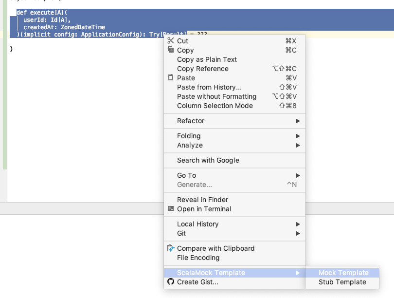
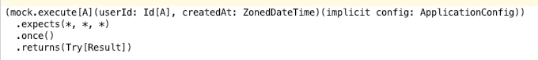

# ScalaMock Template

IntelliJ plugin for Generating templates for ScalaMock.

## Overview

Actions are available under the Edit menu, and a template generated is copied into clipboard.  

#### Menu

#### Pasted

